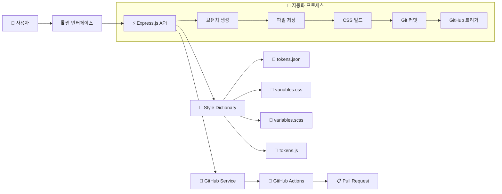
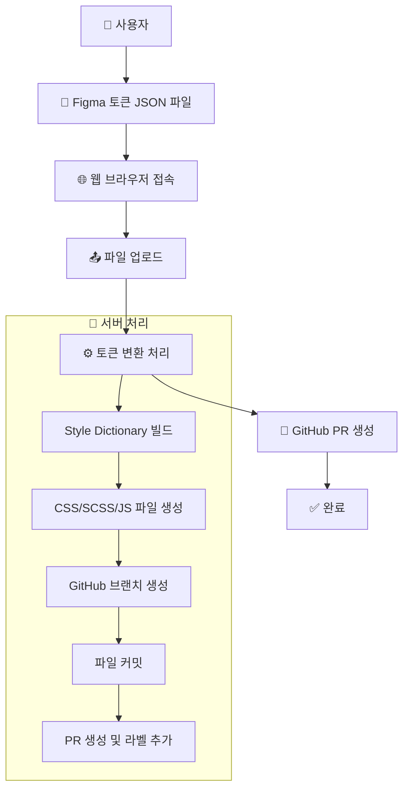

# 🎨 Design Token Sync Server

Figma 디자인 토큰을 자동으로 CSS, SCSS, JavaScript 파일로 변환하고 GitHub PR을 생성하는 자동화 서버입니다.

## ✨ 주요 기능

- **🔄 자동화된 워크플로우**: 파일 업로드 → CSS 변환 → GitHub PR 생성까지 원클릭으로 처리
- **📁 다중 포맷 지원**: CSS Variables, SCSS Variables, JavaScript ES6 모듈 동시 생성
- **🚀 GitHub 통합**: 자동 브랜치 생성, PR 생성, 라벨 추가
- **📊 실시간 진행 상황**: 프로그레스 바와 단계별 상태 표시
- **🔒 안전한 업로드**: JSON 파일 검증 및 중복 업로드 방지

## 🏗️ 프로젝트 구조

```
design-token-sync2/
├── public/
│   └── index.html          # 웹 인터페이스
├── src/
│   ├── server.js           # Express 서버
│   ├── tokenProcessor.js   # Style Dictionary 처리
│   └── githubService.js    # GitHub API 연동
├── uploads/                # 업로드된 토큰 파일
├── output/                 # 생성된 CSS/SCSS/JS 파일
├── .github/workflows/
│   └── design-token-sync.yml # GitHub Actions 워크플로우
├── config.js               # Style Dictionary 설정
├── .env.example           # 환경변수 예시
└── package.json
```

## 🚀 시작하기

### 1. 저장소 클론 및 의존성 설치

```bash
git clone <repository-url>
cd design-token-sync2
npm install
```

### 2. 환경변수 설정

`.env.example`을 `.env`로 복사하고 값을 설정하세요:

```bash
cp .env.example .env
```

```env
PORT=3000
GITHUB_TOKEN=your_github_personal_access_token
GITHUB_OWNER=your_github_username
GITHUB_REPO=your_repository_name
GITHUB_BRANCH=main
```

#### GitHub Token 생성 방법:
1. GitHub Settings → Developer settings → Personal access tokens
2. "Generate new token" 클릭
3. 필요한 권한 선택:
   - `repo` (전체 저장소 접근)
   - `workflow` (GitHub Actions 수정)

### 3. 서버 실행

```bash
# 프로덕션 모드
npm start

# 개발 모드 (nodemon 사용)
npm run dev
```

서버가 `http://localhost:3000`에서 실행됩니다.

## 📋 사용 방법

### 웹 인터페이스 사용

1. **브라우저에서 `http://localhost:3000` 접속**
2. **Figma 토큰 JSON 파일 선택**
3. **"파일 업로드" 버튼 클릭**
4. **자동으로 처리되는 과정 확인**:
   - 30%: 파일 업로드 완료
   - 60%: CSS 변환 진행 중
   - 100%: GitHub PR 생성 완료

### API 엔드포인트

#### `POST /upload`
Figma 토큰 JSON 파일을 업로드합니다.

```bash
curl -X POST -F "tokens=@your-tokens.json" http://localhost:3000/upload
```

#### `POST /build-css`
업로드된 파일을 CSS/SCSS/JS로 변환하고 GitHub PR을 생성합니다.

```bash
curl -X POST -H "Content-Type: application/json" \
     -d '{"filename":"tokens-1234567890.json"}' \
     http://localhost:3000/build-css
```

#### `GET /status`
서버 상태를 확인합니다.

```bash
curl http://localhost:3000/status
```

## 🏛️ 시스템 아키텍처



### 🔧 기술 스택

- **Backend**: Node.js, Express.js
- **파일 업로드**: Multer
- **토큰 변환**: Style Dictionary
- **GitHub API**: Octokit
- **자동화**: GitHub Actions
- **Frontend**: Vanilla JavaScript, HTML5, CSS3

### 🏗️ 컴포넌트 설명

#### 1. 웹 인터페이스 (public/index.html)
- **역할**: 사용자 인터페이스 제공
- **주요 기능**:
  - 파일 업로드 폼
  - 실시간 진행 상태 표시
  - 결과 메시지 출력
  - 자동 워크플로우 실행

#### 2. Express 서버 (src/server.js)
- **역할**: API 엔드포인트 제공 및 요청 처리
- **주요 기능**:
  - 파일 업로드 처리 (Multer)
  - 라우팅 및 미들웨어
  - 에러 핸들링
  - CORS 설정

#### 3. 토큰 프로세서 (src/tokenProcessor.js)
- **역할**: 디자인 토큰 변환 처리
- **주요 기능**:
  - Style Dictionary 설정
  - 커스텀 변환 함수 등록
  - 멀티 플랫폼 빌드 실행

#### 4. GitHub 서비스 (src/githubService.js)
- **역할**: GitHub API 연동
- **주요 기능**:
  - 브랜치 생성 및 관리
  - 파일 커밋
  - PR 생성 및 라벨 추가
  - 변경사항 diff 확인

## 🔄 사용자 작업흐름

### 🎯 전체 워크플로우



### 📋 단계별 상세 흐름

#### 1단계: 사용자 작업 준비
- Figma에서 디자인 토큰 JSON 파일 다운로드
- 브라우저에서 `http://localhost:3000` 접속
- 파일 업로드 버튼 클릭

#### 2단계: 파일 업로드 (30% 진행)
- **POST /upload** 엔드포인트 호출
- 파일 유효성 검사 (JSON 형식)
- `uploads/tokens-{timestamp}.json`으로 저장
- 업로드 완료 응답

#### 3단계: 토큰 변환 (60% 진행)
- **POST /build-css** 엔드포인트 호출
- `TokenProcessor.processTokens()` 실행
- Style Dictionary 설정 적용
- 멀티 플랫폼 빌드 실행
- 결과 파일 생성:
  - `output/tokens.css` (CSS Variables)
  - `output/tokens.scss` (SCSS Variables)
  - `output/tokens.js` (JavaScript ES6)

#### 4단계: GitHub PR 생성 (100% 완료)
- `GitHubService.createPR()` 호출
- 새 브랜치 생성: `design-tokens/update-{timestamp}`
- 파일 커밋 (토큰 파일 + 생성된 CSS/SCSS/JS)
- PR 생성 (제목: "🎨 Design Token Update")
- 라벨 추가: `design-tokens`, `auto-generated`

#### 5단계: 결과 확인
- 전체 프로세스 완료 메시지
- 업로드된 파일명 표시
- 생성된 CSS 파일 목록
- GitHub PR 링크 제공

### 🔄 자동화 워크플로우

#### 실시간 진행 상태
- **30%**: 파일 업로드 완료
- **60%**: CSS 변환 진행 중
- **100%**: GitHub PR 생성 완료

#### 에러 처리
- **파일 업로드 실패**: JSON 형식 검증, 파일 크기 제한
- **토큰 변환 실패**: Style Dictionary 에러 처리
- **GitHub API 실패**: 인증 토큰 검증, 권한 확인

### 🎯 사용자 경험 특징

1. **원클릭 자동화**: 파일 업로드 후 모든 과정 자동 실행
2. **실시간 피드백**: 진행 상태를 시각적으로 표시
3. **에러 핸들링**: 각 단계별 상세한 에러 메시지 제공
4. **GitHub 통합**: PR 생성 후 직접 링크 제공

## 📦 생성되는 파일 형식

### CSS Variables (`output/tokens.css`)
```css
:root {
  --color-primary: #007bff;
  --size-spacing-md: 16px;
  --font-family-heading: 'Inter', sans-serif;
}
```

### SCSS Variables (`output/tokens.scss`)
```scss
$color-primary: #007bff;
$size-spacing-md: 16px;
$font-family-heading: 'Inter', sans-serif;
```

### JavaScript ES6 (`output/tokens.js`)
```javascript
export const colorPrimary = '#007bff';
export const sizeSpacingMd = '16px';
export const fontFamilyHeading = 'Inter, sans-serif';
```

## 🔄 GitHub Actions 워크플로우

프로젝트에는 자동화된 GitHub Actions 워크플로우가 포함되어 있습니다:

- **트리거**: `uploads/`, `output/` 폴더의 파일 변경 시
- **자동 처리**:
  1. 변경 사항 감지
  2. PR 생성 및 라벨 추가
  3. 자동 브랜치 정리

## 🛠️ 개발

### 로컬 개발 환경

```bash
# 개발 서버 실행 (파일 변경 시 자동 재시작)
npm run dev

# Style Dictionary 직접 실행
npm run build-tokens
```

### 프로젝트 확장

1. **새로운 출력 형식 추가**: `config.js`에서 새로운 플랫폼 정의
2. **커스텀 변환 규칙**: `src/tokenProcessor.js`에서 transform 함수 추가
3. **추가 GitHub 기능**: `src/githubService.js`에서 새로운 메서드 구현

## 🔍 트러블슈팅

### 일반적인 문제들

**Q: GitHub Token 권한 오류**
- GitHub Token에 `repo` 권한이 있는지 확인
- Token이 올바르게 `.env` 파일에 설정되었는지 확인

**Q: 파일 업로드 실패**
- JSON 파일 형식인지 확인
- 파일 크기 제한 확인 (기본값: 제한 없음)

**Q: GitHub Actions 실패**
- Repository Settings에서 Actions 권한 확인
- `GITHUB_TOKEN` 권한 범위 확인

### 로그 확인

서버 로그에서 상세한 오류 정보를 확인할 수 있습니다:

```bash
npm run dev  # 개발 모드에서 상세 로그 확인
```

## 📄 라이선스

MIT License

